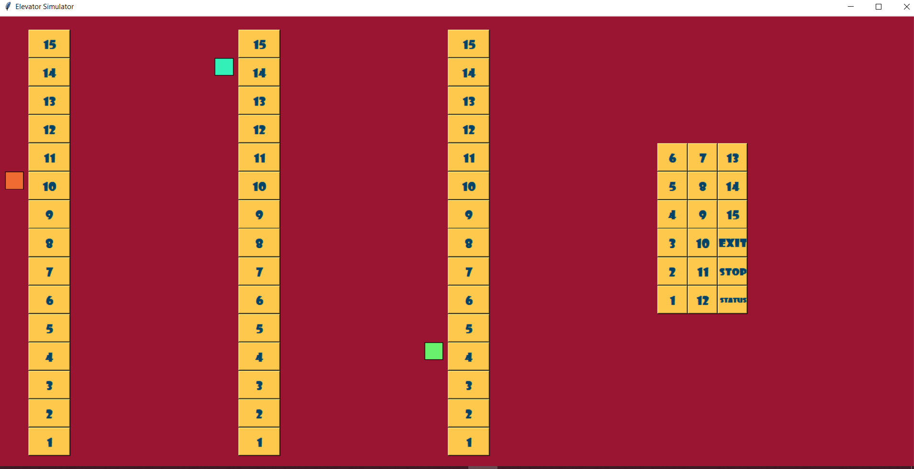

# Elevator_Simulation
Final OS Project - Simulating parallel movment of 3 elevators with GUI and considering Starvation, Utilization and Internal and External requestss

## 🎯 Simulation Environment

* you can click each level you wanna go with the elevator you want, in two ways: internal or external option request. 
and then the algorithms choose the appropriate elevator according to Starvation, Utilization and Internal and External requests.
you can also use multiple elvators and the program works in parallel.
